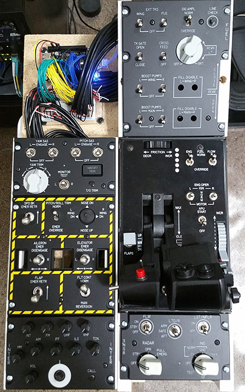

# Cockpit

Flight simulator hardware compatible with [DCS-BIOS](https://dcs-bios.readthedocs.io/en/latest/) running on a [BeagleBone Black](http://beagleboard.org/black) and powered by [Nerves](https://hexdocs.pm/nerves/getting-started.html).

